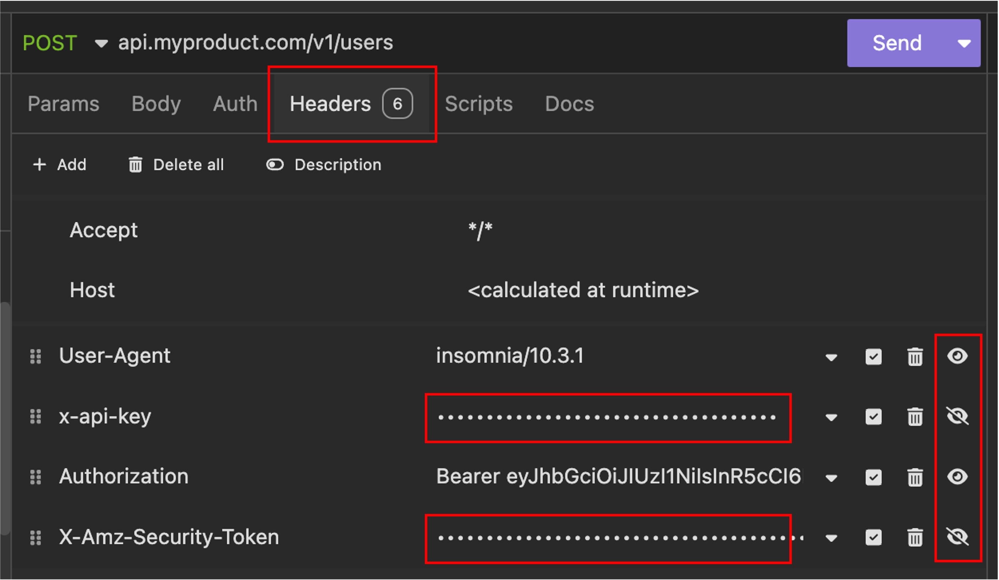

# Insomnia Plugin: Mask Requests Headers 

## Overview
This Insomnia plugin adds a toggle button that **allows users to mask sensitive** values in HTTP request **headers**. The masked values will be replaced with `******` for improved privacy and security when presenting or displaying requests.

## Features
- **Toggle masking on/off at request level**: Easily switch between masked and unmasked values.
- **Persistent settings**: Masking preferences are saved across sessions.
- **User-friendly interface**: Intuitive toggle button integrated into Insomnia’s UI.

## Usage
1. Open an API request in Insomnia.
2. Locate the masking toggle button in the request tab.
3. Click the toggle to enable or disable masking.
4. When enabled, sensitive values in headers and/or query parameters will be replaced with `******`.

## Installation
1. Open Insomnia.
2. Navigate to `Preferences` > `Plugins`.
3. Search for `insomnia-plugin-header-masker` or go to official Insomnia [Browse Plugin Hub](https://insomnia.rest/plugins).
4. Click `Install Plugin`.
5. Hit Reload Plugins or restart Insomnia if necessary.

## License
This project is licensed under the MIT License.

## Contributions
Contributions are welcome! Feel free to submit issues, feature requests, or pull requests to improve the plugin.

## Contact
For questions or feedback, open an issue on the GitHub repository or reach out directly.

